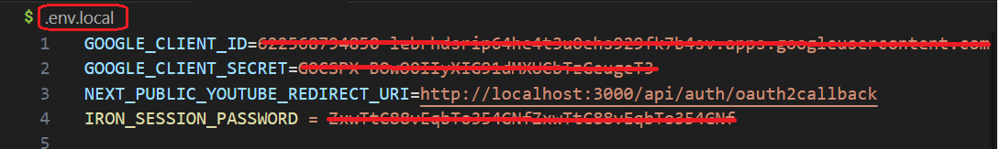
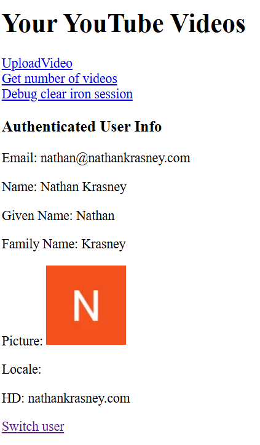

<h1>Project Name</h1>
 Next.js server actions with OAuth2 , YouTube API and refresh tokens 

<h2>Project Description</h2>
This project leverages Next.js's App Router to interact with the YouTube API on the server. It allows you to:
<ul>
<li>Uploading video to your YouTube channel</li>
<li>Get number of videos in your YouTube channel</li>
</ul>

<h2>Technologies Used</h2> 
<ul> 
<li>Next.js</li> 
<li>OAuth2</li> 
<li>YouTube API</li> 
<li>Iron Session</li> 
<li>Suspense</li> 
<li>Higher Order Functions (HOF)</li> 
</ul>

<h2>Motivation</h2>
I already have a solution (<a id='reference1'>[1]</a>) using the pages router with API routes for handling OAuth2 and the YouTube API. However, I wanted to explore how to achieve the same functionality with server actions. This repository demonstrates the new approach.


<h2>Installation</h2>

<h3>Dependencies</h3>
To install all dependencies, run:

```ts
pnpm i
``` 

Alternatively, you can use npm:

<h3>Google Cloud Console Project</h3>
  <ol>
    <li>Create a Google Cloud Console project.</li>
    <li>Enable Google API.</li>
    <li>Use OAuth2 for authentication.</li>
    <li>Add scopes according to SCOPES constant in the project</li>
  </ol>

 
<h3>.env.local</h3>
This file is included in .gitignore. You can obtain GOOGLE_CLIENT_ID and GOOGLE_CLIENT_SECRET from the credentials file in your Google Cloud project.

Below is an image of the .env.local file:



<h3>Scopes</h3>

```ts
const SCOPES = [
  "https://www.googleapis.com/auth/youtube.upload", // required for youtube.videos.insert and youtube.thumbnails.set,
  "https://www.googleapis.com/auth/youtube.readonly", // -- require to get video list
  "https://www.googleapis.com/auth/userinfo.profile", // -- require to get user profile
  "https://www.googleapis.com/auth/userinfo.email", // -- require to get user email
];
```


<h2>Usage</h2>
Run the devlopment server using

```bash
npm run dev
```

<h2>Design</h2>
The design that is new in this repo has four parts  

<h3>1. Utility function for refresh token and redirect</h3>

```ts
function checkAndRefreshToken(): Promise<{
  oauth2Client: OAuth2Client | null;
  redirectTo?: string;
}>;
```

<h3>2. Generic HOF with server-side redirect</h3>

```ts
export function withAuthHOF<T extends object, R>(
  serverAction: (params: ServerActionArgs<T>) => Promise<R>
) {
  return async function (params: T) {
    const { oauth2Client, redirectTo } = await checkAndRefreshToken();
    if (redirectTo) {
      redirect(redirectTo);
      //return null; // Redirection has already been handled
    }
    if (!oauth2Client) {
      throw new Error("OAuth2 client not available. Authentication failed but missing redirectTo");
    }
    const augmentedParams: ServerActionArgs<T> = { ...params, oauth2Client };
    return await serverAction(augmentedParams);
  };
}
```

<h3>3. Specific server action wrapped with HOF</h3>
withAuthHOF injects authenticated oauth2 object  

```ts
const getUserVideosWithAuth = withAuthHOF<UserVideosParams, UserVideosResult>(
  getUserVideos
);
```

<h3>4. Use the server action in a component:</h3>
Here is a simplified usage without handling error and loading states

```ts
const VideosPage: FC = async () => {
  const videos = await getUserVideosWithAuth({});
  const videoCount = videos?.length || 0;

  return (
    <div>
      <h1>User Videos</h1>
      <p>Total videos: {videoCount}</p>
    </div>
  );
};
```


<h2>Demo</h2>

Below is an image of the home page with buttons:

<ul> <
li><strong>Upload Video</strong>: Navigate to the server component under <code>app/upload-video</code> and upload a video from the data folder to your YouTube channel.</li> 
<li><strong>Get Number of Videos</strong>: Navigate to the server component under <code>app/videos</code> and get the number of videos in your YouTube channel (limited to 10).</li> 
<li><strong>Debug Clear Iron Session</strong>: Use this to invalidate the OAuth2 object.</li> 
<li><strong>Switch User</strong>: Choose the Gmail account of your YouTube channel to authenticate with.</li> 
</ul> The authenticated user information is also presented.



 
<h2>Points of Interest</h2>
<ul> <li><strong>Debug Clear Iron Session</strong> is actually the logout functionality.</li> <li><strong>Switch User</strong> is the login functionality.</li> </ul>

<h3>References</h3>
<ol> <li id='reference1'><a href='https://www.youtube.com/watch?v=jD6u7X2rYew'>Next.js YouTube API Tutorial: Authentication and Refresh Token</a></li> </ol>

